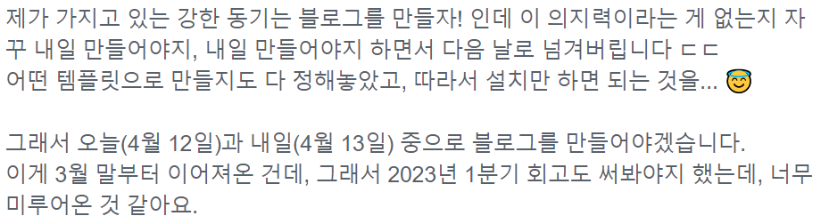

#### 근본적인 문제(?)

2월 한 달은 정말 쉬는 것에만 집중을 했다. 그러면서도 관심 가는 기술 스택에 대해서는 인프런이나 유데미를 통해 장바구니에 담고 몇십만 원씩 구매를 했고, 그 결과 들어야 할 강의들이 많이 밀려있다.

3월 들어서는 HTTP 웹 지식에 대해서 다시 공부하고, CS에 대해 너무 취약한 듯하여 컴퓨터 구조와 운영체제 관련된 자료도 찾아보고 서비스 내에 있는 노트 기능으로 나름대로 정리를 했다.

다만, 동영상 강의 특성상 듣고 보는 거에만 익숙한지 `기록을 하는 순간이 현저히 적었고` 나중에 관련 내용을 다시 찾아보게 되는 일이 잦았다.

해당 내용들을 얼마나 잘 정리해서 올릴 수 있을지는 모르겠지만, 그래도 어딘가 기록을 할 필요성을 느끼게 해주었다.

#### 발췌, 요약, 리라이팅 리츄얼

느슨해진 마음을 그래도 강제로 견인해 주고 있는 프로그램 중 하나인데, 어떤 콘텐츠든 읽고 발췌+요약+리라이팅을 매주 5회씩 인증하는 것을 진행하고 있다.

생각보다 읽는 콘텐츠의 양이 많으면서도 내가 취할 수 있는 콘텐츠가 서로 다르다는 걸 깨닫고 있는 요즘인데, 이걸 계속 하다 보니 개인적으로 블로그를 통해서도 정리를 해봐야겠다는 생각이 들었다.

혼자만 참여하는 게 아니라 다른 분들이 올려주는 콘텐츠를 읽고 새로운 콘텐츠를 알아가는 것도 재미 중 하나이다. 주로 내가 발췌 요약하는 콘텐츠는 자기 계발과 관련된 쪽인데, 시작을 미루지 말라는 것, 습관 등으로 궤가 일치하는 것 같다.

그러던 와중, 블로그를 만들고 올릴 것이라는 짧은 내용을 지난주에 같이 작성했고 계속해서 미뤄지는 것이 더는 안되겠다 싶어 그래도 지금에 이르렀다.

---

---

비록 선언했던 기간을 지키지는 못하고 원하던 템플릿을 사용해서 만들지는 못했지만, 매우 간단한 스타터 템플릿으로 사용하여 블로그를 만들었다. 이제 글을 쓰고 차차 블로그 커스터마이징과 관련된 살을 붙여나가는 것을 목표로 하고자 한다.

#### 자기계발 책

비슷한 결의 책을 많이 읽다 보니 생각보다 글쓰기를 시작하라는 내용이 많았다. 🫠

#### 끝

내용이 두서없지만 수정이라는 선택지도 있으니 우선은 마무리하고 꾸준히 쓰도록 노력해 봐야겠다.
